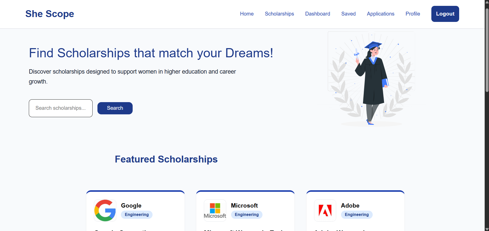
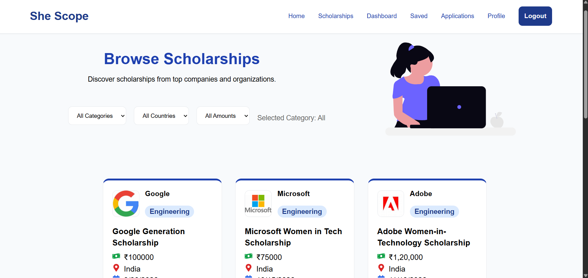
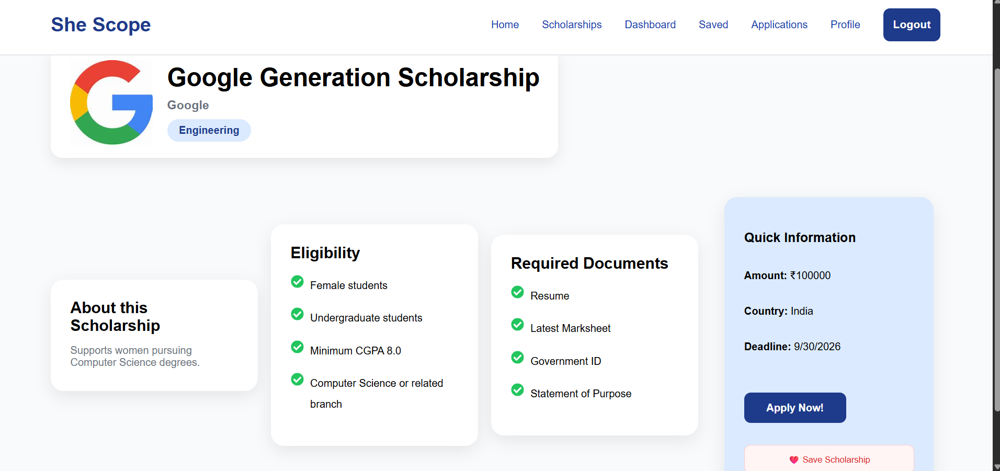
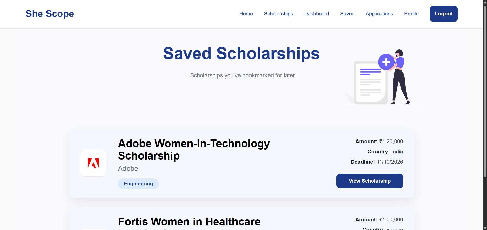
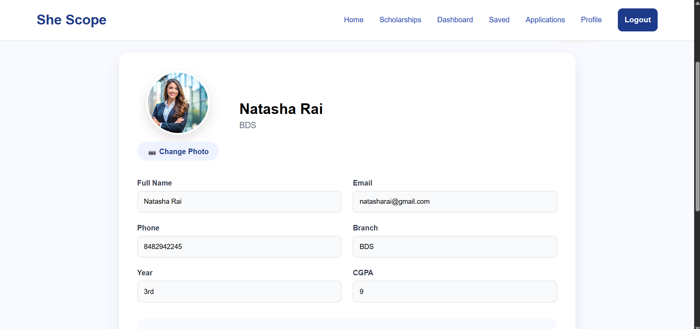
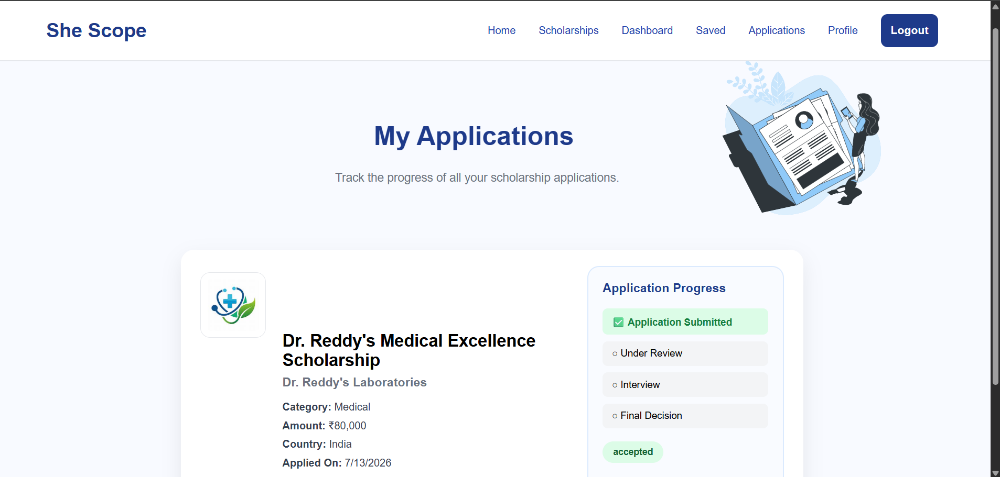

# SheScope – Women Scholarship Portal

SheScope is a full-stack MERN web application designed to help women discover, save, and apply for scholarships through a simple and intuitive platform. It enables students to explore opportunities, manage applications, and maintain their profiles while providing a seamless scholarship search experience.

---

##  Features

###  Student Features

- 🔐 User Registration & Login
- 🔑 Secure JWT Authentication
- 🎓 Browse Scholarships
- 🔍 Search Scholarships
- 🎯 Filter Scholarships by Category, Country & Amount
- 📄 View Scholarship Details
- ❤️ Save & Unsave Scholarships
- 📝 Apply for Scholarships
- 📊 Dashboard with Application Statistics
- 📈 Track Application Progress
- 👤 Edit Profile
- 🖼 Upload Profile Picture
- 📄 Upload Resume (PDF)

---

## 🛠 Tech Stack

### Frontend
- React.js
- React Router DOM
- Axios
- CSS3

### Backend
- Node.js
- Express.js
- MongoDB
- Mongoose
- JWT Authentication
- Multer
- Cloudinary

---

## 📂 Project Structure

```
SheScope
│
├── client
│   ├── public
│   ├── src
│   └── package.json
│
├── server
│   ├── config
│   ├── controllers
│   ├── middleware
│   ├── models
│   ├── routes
│   ├── uploads
│   └── server.js
│
├── screenshots
│
└── README.md
```

---

## 🚀 Installation

### Clone the Repository

```bash
git clone https://github.com/your-username/SheScope.git
```

### Install Frontend

```bash
cd client
npm install
npm run dev
```

### Install Backend

```bash
cd server
npm install
npm run dev
```

---

## 🔑 Environment Variables

Create a `.env` file inside the **server** folder.

```env
PORT=5000

MONGO_URI=your_mongodb_connection_string

JWT_SECRET=your_secret_key

CLOUDINARY_CLOUD_NAME=your_cloudinary_cloud_name
CLOUDINARY_API_KEY=your_cloudinary_api_key
CLOUDINARY_API_SECRET=your_cloudinary_api_secret
```

---

# 📸 Screenshots

## 🏠 Home Page



---

## 🎓 Scholarships Page



---

## 📄 Scholarship Details



---

## ❤️ Saved Scholarships



---

## 👤 Profile



---

## 📝 My Applications



---

## API Endpoints

### Authentication

- Register User
- Login User

### Profile

- Get Profile
- Update Profile
- Upload Profile Picture
- Upload Resume

### Scholarships

- Get All Scholarships
- Get Scholarship Details
- Search Scholarships
- Filter Scholarships

### Applications

- Apply for Scholarship
- View My Applications
- Track Application Progress

### Dashboard

- View Dashboard Statistics

---

## Key Highlights

- Secure authentication using JWT
- Image uploads handled with Cloudinary
- Resume upload support
- Real-time scholarship search
- Dynamic filtering
- Application tracking dashboard
- Clean and modern user interface

---

## 👩‍💻 Author

**Anushkaa Bhargava**

Computer Science Engineering Student
